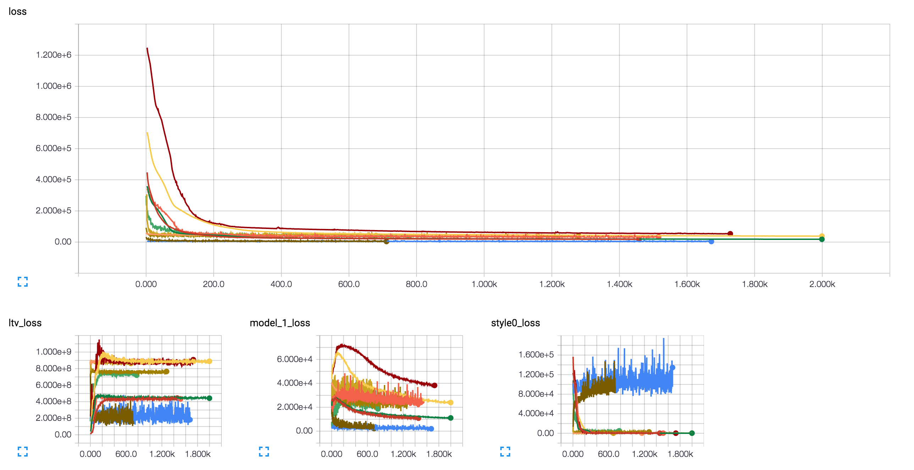

# A journey into Neural Style
Hello!

This repository contains some work i did on the neural style algorithm to get a better sense of it.
You can find all the different script to download, pretrain and train model. Using tensorflow, tensorboard and Keras.

You potentially can change the Keras backend to Theano, but you might have to tweak some stuff here and there then.

## Architecture
- **data:** Holds all images input/outputs
- **docker:** Holds the dockerfile used to run those experiments (see the docker section for more information)
- **mobile_app:** Holds all the mobile files and README to make your tensorflow model work on IOS
- **models:** Holds models/layers python python files + models architecture/weights output files
  - **ATrouConvolution** layer for Keras
  - **ConvolutionTranspose2D** layer for Keras
  - **ScaledSigmoid** layer for Keras
- **perf:** Holds very simple perf scripts to have an idea on how much you loose when you go from the titan X to an iphone 6s...
- **tests:** Holds some tests sherlocks
- **torch:** Holds some work done in torch, especially a keras neural net importer
- **utils:** Holds utils to do preprocessing/training etc.
- **vgg:** Holds vgg19 data and script files
- Python files:
  - **alpha.py:** See the impact of alpha parameter
  - **layer_reconstruction.py:** Reconstruct data with iteration from the VGG
  - **layer_influence.py:** See the influence of each layer against each layer on VGG
  - **ltv.py:** See the influence of loss total variation
  - **predict.py:** Generate new image from a trained model
  - **pretrain_model.py:** Pretrain model on overfit data (see below)
  - **train.py:** Train a pretrain model to achieve deep art
  - **.sh:** files: Some script to do batch work

## Docker
You should know if you want to use GPU or CPU (you might be an immortal dude, who knows) and if you want everything installed locally or on a container
- Use `pip install -r requirements.txt` to have everything locally (use virtualenv, you fool)
- Use nvidia-docker to run my docker-image **(Beware you need cuda 7.5 and cudnn5 locally)**:
```bash
# port 6006 used for tensorboard
nvidia-docker run -it -d -p 6006:6006 -v /my/aboslute/path/to/deepback:/root/deepback --name deepback morgangiraud/dlsak
```

## I want to create deep art
**First:** Download data! (Be aware, this will download around 20GB of data...)
```bash
# From data directory
./data/download_images.sh
```

**Second:** Download the VGG19 and preprocess it!
```bash
# From vgg19 directory
./download_weights.sh
```

**Third:** Build some overfit data to pretrain some models! (You can control how many overfit images you want)
```bash
# From root directory
./data/build_ovefit_folder.sh
```

**Fourth:** Pretrain models

*If you only want to initiliase a model weights, you can do it by setting the --nb_epoch parameter to 0 manually*
```bash
# From root directory
./pretrain_model.sh
```

**Fifth:** Finally, train your model!
```bash
# From root directory
python train.py --model_dir models/path/to/model
```

**sixth:** Generate some images!
```bash
# From root directory
./predict.sh path/to/my/model
```
**Amen**

## Making it happen in your Iphone:
**First:** Export your trained model
```
python export_keras_model.py --model_dir models/path/to/model
```

**Second:** Copy the `pb` file into `mobile_app/data` directory

**Third:** See the [Mobile Readme](mobile_app)

## Tensorboard
Tensorboard feature is built-in only in the `train.py` file.

While you are training our model, you can see in real-time your loss evolution and intermediate images result (train/cross val):
```bash
docker exec -it my-nvidia-docker-name bash
tensorboard --logdir /path/to/my/parent/models/folder --reload_interval 20
# If you launch tensorbaord in an already populated folder, it might take time before it can 
# squash all the data
```
Access your board: http://my-dns.com:6006 and get something like that:


Tensorboard doc [here](https://www.tensorflow.org/versions/r0.9/how_tos/summaries_and_tensorboard/index.html)

## Performance result
**We can see a x703 time slower in a tensorflow CPU non-quantized implementation versus the AWS GPU**

| Infrastructure | Time |
|:--:|:--:|
| tensorflow GPU K420 AWS: | ~0.0329s (batching) 0.026s (looping) | 
| tensorflow mac os:  | 4.13s (batching) 3.31s (looping) |
| tensorflow mac os simulateur:  | 5.86s (float32) 16.9 (quantized, this is weird) |
| tensorflow iphone 6s CPU: | 18.30s (float32) |

**Image size**: 600x600

**batching**: all image are processed in parallel

**looping**: one image at a time

**quantized**: Using tensorflow quantization system, (Shouldn't be slower, probably needs a cleaner tf graph)

# Other stuffs
### Using ffmpeg to create unstable deep art videos
Resize: `ffmpeg -i test_video.MOV -filter:v "crop=600:600:70:400" out.mp4`
video to frames: `ffmpeg -i out.mp4 -r 30/1 $filename%03d.jpeg`
**predict frames HERE**
frames to video: `ffmpeg -framerate 30/1 -i %03d.jpeg -c:v libx264 -r 30 -pix_fmt yuv420p out.mp4`

# Aknowledgment
- Thanks to [@karpathy](https://github.com/karpathy), [@jcjohnson](https://github.com/jcjohnson) and [@leongatys](https://github.com/leongatys) for their work/code! :beers:
- :+1: Tensorflow
- :+1: Keras