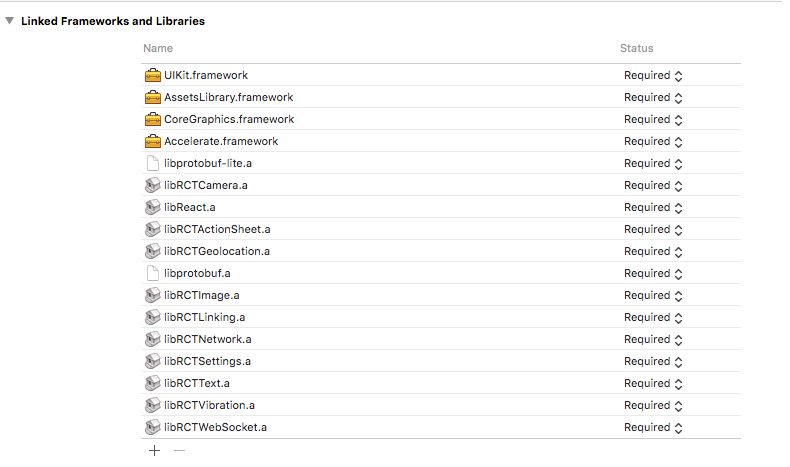

# React-Native + Tensorflow

This folder is an example of how to use Tensorflow with iOS by running a neural-style transfer network.

### Tensorflow:

- Clone `tensorflow` https://github.com/tensorflow/tensorflow where you cloned `deepback`.
- Build the libs:

```bash
cd tensorflow/tensorflow/contrib/makefile
./build_all_ios.sh
cp gen/lib/libtensorflow-core.a ../../../../deepback/mobile_app/lib/
cp gen/protobuf_ios/lib/libprotobuf-lite.a ../../../../deepback/mobile_app/lib/
cp gen/protobuf_ios/lib/libprotobuf.a ../../../../deepback/mobile_app/lib/
```

If you have any trouble with the Tensorflow's iOS build, please check the official doc here: https://github.com/tensorflow/tensorflow/blob/master/tensorflow/contrib/makefile/README.md#ios

### React-Native

Install the mobile app's dependencies

```bash
cd deepback/mobile_app
npm i
```

### Xcode

- Open the project located at `deepback/mobile_app/ios/ReactNativeTF.xcodeproj` with XCode.

If you cannot see the libRCTCamera.a added to your Linked Frameworks and Libraries, you should link it:



```bash
npm install rnpm --global
rnpm link react-native-camera
```

or, if you'd rather manual install: https://github.com/lwansbrough/react-native-camera#ios

- Build the project and run it from the Simulator.

### Run the project from your phone

To run the project from your phone, you'll have to package it. Edit `deepback/mobile_app/ios/ReactNativeTF/AppDelegate.m`

Comment this line
```javascript
jsCodeLocation = [NSURL URLWithString:@"http://localhost:8081/index.ios.bundle?platform=ios&dev=true"];
```

And uncomment his line
```javascript
jsCodeLocation = [[NSBundle mainBundle] URLForResource:@"main" withExtension:@"jsbundle"];
```

Then, from XCode, change the build target to select your connected iPhone.
